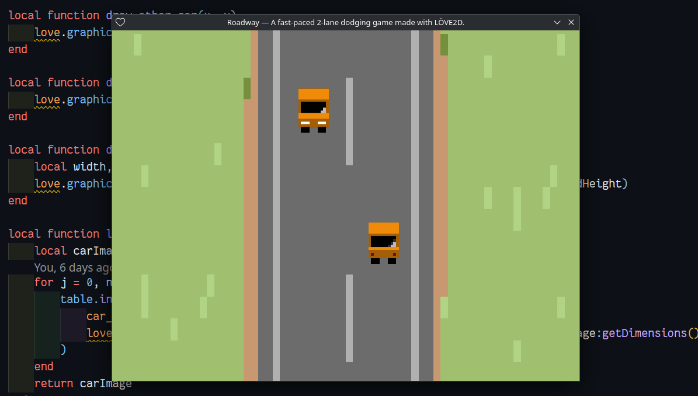

# Roadway



<p align="center"><i>🚗 A fast-paced 2-lane dodging game made with <strong>LÖVE2D</strong>. Avoid oncoming cars, survive the road, and watch out for explosive crashes!</i>
    <br>
    
</p>

**Roadway** is a straightforward but fun arcade-style car game where you dodge oncoming traffic on a scrolling two-lane road. React fast, switch lanes, and try to survive as long as you can — or crash and explode in flames!

Built using [LÖVE2D](https://love2d.org/), this game features smooth animations, sound effects, and simple keyboard controls. It's a great starting point for anyone looking to make their first 2D game in Lua.

---

## Controls

- **Left / A** – Switch to left lane
- **Right / D** – Switch to right lane 
- **Up / W** – Move up
- **Down / S** – Move down
- **P** - Pause/unpause the game
- **Q or Esc** – Quit the game

## Features

* Two-lane dodging gameplay
* Animated player and enemy cars
* Explosions on collision
* Looping road background
* Simple, responsive controls
* Sound effects: button clicks, crashes, engine loop
* Auto-quit after crash animation

## Running the Game

### Requirements

- [LÖVE2D 11.5+](https://love2d.org/) installed

### Steps to Run

1. Clone the repository:

```bash
git clone https://github.com/ashkanfeyzollahi/roadway
```

2. Change to the project directory:

```bash
cd roadway
```

3. Run the game using LÖVE:

```bash
love .
```

> 💡 Make sure all asset files are inside the assets/ folder.

## Folder Structure

```plain
roadway/
├── assets/
│   ├── button-click.mp3
│   ├── car-crash-sound-effect.mp3
│   ├── Car_Engine_Loop.ogg
│   ├── road.png
│   ├── other_car.png
│   ├── player_car.png
│   ├── explosion1.png
│   └── ... (explosion2.png to explosion8.png)
├── main.lua
└── screenshot.png
```

## Acknowledgements

Thanks to:

- [LÖVE2D](https://love2d.org/) for making 2D game dev approachable in Lua.
- Free sound and sprite resources from open game art communities.

## Bug Reports

Found a bug or have a suggestion? [Open an issue](https://github.com/ashkanfeyzollahi/roadway/issues) on GitHub.
